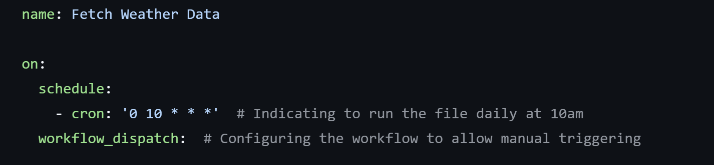

<h1 align="center">Computer Infrastructure</h1>

## Table of Contents
  - [Table of Contents](#table-of-contents)
  - [Overview](#overview)
  - [Repository Structure ](#repository-structure)
  - [Running The Python File](#runcode)
  - [Task One - Create Directory Structure](#task-one)
  - [Task Two - Timestamps](#task-two)
  - [Task Three - Formatting Timestamps](#task-three)
  - [Task Four - Create Timestamped Files](#task-four)
  - [Task Five - Download Today's Weather Data](#task-five)
  - [Task Six - Timestamp The Data](#task-six)
  - [Task Seven - Write The Script](#task-seven)
  - [Task Eight - Notebook](#task-eight)
  - [Task Nine - Pandas](#task-nine)
  - [Project - GitHub Actions Workflow ](#task-p)
    - [Project - Task One - Create a GitHub Actions Workflow ](#task-p-one)  
    - [Project - Task Two - Run Daily at 10am ](#task-p-one)  
    - [Project - Task Three - Use a Linux Virtual Machine ](#task-p-one)  
    - [Project - Task Four - Clone the Repository ](#task-p-one)
    - [Project - Task Five - Execute the weather.sh ](#task-p-one)
    - [Project - Task Six - Commit and Push Changes Back to the Repository ](#task-p-one)
    - [Project - Task Seven - Test the Workflow ](#task-p-one)
  - [Contributors ](#contributors)
  - [License ](#license)


<h2 align="center">Overview</h1><a name="overview"></a>
The purpose of the assessment is for you to demonstrate ability in the following:

- Use, configure, and script in a command line interface environment.
- Manipulate and move data and code using the command line.
- Compare commonly available software infrastructures and architectures.
- Select appropriate infrastructure for a given computational task.

The assessment consists of three overlapping parts: a GitHub repository containing all your work (20%), a series of tasks (40%), and a small project (40%).

<h2 align="center">Repository Structure</h1><a name="structure"></a>

- `.github`: A folder containing the GitHub Actions workflow for the Project .
- `data`: A folder containing the timestamps and weather sub folders for the tasks.
- `images`: A folder containing the screenshots used in creating the ReadMe and weather.ipynb notebook.
- `weather_files`: A folder containing the json files that have been created by the GitHub Actions Workflow.
- `.gitignore`: File to specify untracked files to ignore in the repository.
- `20241125_223027.json`: Output json file from the tasks.
- `LICENSE`: File containing the MIT License details used for the project.
- `README.md`: Overview of the project and repository.
- `Task_9.ipynb`: Python notebook with analysis of one of the json files outputted from the script.
- `weather.ipynb`: Python notebook with description of steps taken to complete tasks 1 - 7.
- `weather.sh`: The shell script being used to download the weather data from the Met Eireann API.


<h2 align="center">Running The Script</h1><a name="runcode"></a>

### Dependencies for Tasks

The following dependencies are required for running the code related to Tasks 1 to 7 and the Project:

- mkdir - Installed by default on most Linux Based Systems.
- date - Installed by default on most Linux Based Systems.
- echo - Installed by default on most Linux Based Systems.
- wget - May require Installation
- git - Installed by default on most Linux Based Systems.
- chmod - Installed by default on most Linux Based Systems.

If the files need to be installed the below code should be ran:

**WGET**
```
sudo apt update
sudo apt install wget
```

**git**

```
sudo apt-get install git
```

**mkdir, date & echo, chmod**
These commands are part of the coreutils package, so the below code should be ran to make sure they are installed:

```
sudo apt install coreutils
```

It should be noted that the GitHub Actions Workflow installs the dependencies as part of its steps.

     
<h2 align="center">Task One - Create Directory Structure</h1><a name="task-one"></a>
<p align="center">
  
</p>

### Task
Using the command line, create a directory (that is, a folder) named data at the root of your repository. Inside data, create two subdirectories: timestamps and weather.

### Files Created

**Parent Directory** - data <br>
**Sub-Directories** -  timestamp & weather


### Inputs
To create the parent directory for data I used the below code:<br>

#### Task 1 - Input - Data Directory


To create the sub-directorie for weather and timestamps I used the below code:<br>

#### Task 1 - Input - Timestamp & Weather Sub-Directory


#### Cleaning Up Structure:


### Outputs
#### Task 1 - Output - Data Directory


#### Task 1 - Output - Timestamp & Weather Sub-Directory

   
### Folder Structure
#### Before:


#### After:


Following review of the structure of the repository, I decided I did not need the "Tasks" or "Project" for the purpose of the assignment so removed them. <br>


### Code<br>
```
mkdir data # To create the Data Directory at the root of the repository

```

```
mkdir data/timestamps data/weather # To create the sub directories inside the data directory for the timestamps and weather folders.

```


```
rm Tasks # Remove Tasks folder.
rm Project # Remove Project folder.

```

### Code Explanation
The mkdir command was used to make the data directory/ folder. The mkdir is a command used to make a directory in a file system.

You first call the mkdir command and following this you input the name of the directory you want to make.

To create the sub-directories, the mkdir command can be used with the name of the parent directory followed by a forward slash and the name of the sub directory.

As the parent directory was already included, I did not need to use the -p flag to create the parent directory.

### References
1. https://www.geeksforgeeks.org/mkdir-command-in-linux-with-examples/
2. Class Notes, Computer Infrastructure , Ian McLoughlin,  Semester 1

<h2 align="center">Task Two - Timestamps </h1><a name="task-two"></a>
<p align="center">
  <img src="data:image/png;base64,iVBORw0KGgoAAAANSUhEUgAAAOEAAADhCAMAAAAJbSJIAAAAhFBMVEX///8AAAC0tLSjo6P29vbi4uI/Pz+/v799fX38/PzZ2dnz8/P5+fleXl7s7Ozo6OiVlZWtra3W1tbPz89sbGyGhoZjY2OWlpa9vb0pKSnHx8ecnJxSUlIuLi4bGxshISGMjIwNDQ1ycnJGRkY2NjZLS0t5eXk8PDwUFBQkJCSCgoJXV1cH4zaOAAAScklEQVR4nO1d63aqOhCuqFXEG2qtxaqgtRf7/u93tkomk2SCTAjYdZbfr70phgyZzD3D09MDDzzwwAMPPPDAAxZEq4BAL7z3vLwhbVkQ3HtmnrC2EdhqJfeemxeEdgJbx3tPzgsGBRS27j05L+j+7yl82tkJXNx7bn6Q2Cmc3Htu5REOC/44/6Lp+x0XDul5ipUw2H+3lrOCG8bdf5jEgrRkcv5/VPSDl83bfuB7nq6IXvJ537qxJyjs3rpzsr3c1y96Cc2hLea9vXVneQqX4s61nzlWwXwj91URn55RmsKOHPPnzmZPd9lCuDWZ0hSO8aijmyteH0LNpC4UjU8MCjVD76VIUNeJIFMnsr/1g/L7UPdGYj8z5mF+0GaxvKnAylP4tNcG/5p7mTQDE30KP73iH4y7gxm4UfFs1r3B0slGe8CiWfvHcPlerQsYzoPp4vCT6b/Ifj5GaTC3/66t/2JaDy0UEn26S1ozD2ftpUGZgWV7RkuSjs4nrVWdVCGsjEmOzJuGs/T3JnFygOmsY44xNe5r10/dGcQMtU0YrRb6NrqJt31PI3JC3HVLIXnBnHjwBm+n3ohLncBCsRmWxB2N8Cnp7oH9OOi7knfFqVv4nEaicxE87nn+Dv++sM8weKemxcMoj6OCU/mNVO8t09cPTvnTYhxl+mfQhOuCeAUHP2eBAs7ked2C/J9NxeYujNgfYmpbrbkp+QS+P5avQW/eBaUQdeerOB29ZdafrCWnHM6/CC8+6LExA3XSS3KhFtknecFmuU7sNtpwkKS/txY+Z8zxKm6GRXUYlodEto+7JV56NFhTUlPgpj1fO94s5KUzRihp2LOK4EY0YCEo9fiTOjDUfJ8RQzVkxRQhMCY1ShwDgVFwNAZryhS1YmIYn2klL2fwqY+3IAzWBqEvYNauHMcVsUk5ZuPOr8Rwoc5l62fTdHTNmnoZ1gGDD3Uia2/8NNbW8Xgfgapx6KfXWXQ1/+QenKq+5ufCHEM46cXTxVGozmxz3L/GybhwzyY/ygMa1xrDZcnnd7px39QBOd5Pgd3q0aKxp1rosKKj5MuONgXRDZYWk0fiY7Gy8fdM2ehEqKQ+jBVr+dVyU1uTRHYcYkuSSdkKz82FvpXM/I7cgcNADxjfwO+KnL/i6G+aEqlKccWSUhHdl28efWd8TylmH+NNvGuGRGUFqSjtoMgZKsSeciVP6IZtEylThUAilK9rMh6WxDrG6O8NrOIkk4/LTB9pvNDnDNgcQAC/Hz+sbNw3acCbcVP3KkZIim6M9x3SsZrNYtrrTjpyppOncNxNXve0sDWV6wC91kPNFCI9+Ga8zfmPMdt/axKD7WJk18JoRfn2G0M8Y85Z1kkfDkN/6dLdTKS03qbKXOn84WBqWgUvukEXoXvqtG6QHXXQtYSxgFlf36bWDOnsM9N+/KH/dow4ur6MMPImPnQWfdWXjzBTCnLAUayncvTdON7Kv9XlaSA98a1NP9RVBPmai7PcupRaaJyKCzTqiWwM0VbQpGh3q82u9UmNUEyhIVh1WY1sqXc/JGlAgkTjEipLRFmrMEVq+NgcQ4/Q9OSf6sh4o00YWP9y4y3n1vgL8aeINAE0mwkF2P1H+NEuSK2P/ffaba/hSsaFE0lHT/pJCsdro0g+2nkvzpSJwV/1D0pZxkkG+X9Ibyj4PJG1YVKKLULF8NNE1jP8gdzpFSB3yY8qRhUCE7wnWZEVKYvH2pZUSUS5fb8qAyXR1IHxZK6yD4Lgb4zxhzDIJWAwwySqcX256T8q0qRCMo4qxLCQye1FyW+M8eFHeclDhCMEKltLQ9anPJX5pYPlOhKQQmY8c56gL1iIvWhF84RSEnmsA5MWlaKru5mchQxHdfKrrLKJPCGDdAxSv6rbK1+rPy9DbjalKHmIrBAsVgbqmpZCeJHVb9gaQ36VWqAg01O+hI0UAyrjIUZS5WanvX9ha+Te515bdURiH1+PtvR83CFNYuWdIU1viZhWBVKMikCV8u1GyWdJSE2hnOFBnkbf9tOqQJFEZSuC3vcT0pBLiHV9KDdhfeF2tNOVrSi9DB+LKE8GpPiydPc/agy2I0ZRtjqIAB+LKLcbXkLkq7EOC3TmPBGEHDOs/STlHsQpjKWIE6khWcUSZyt2x+Is6XMoFj9oy+q+MMitLdZVcmFZUiZnbdYxGClt8JuRi1j5vAkYiNgKRIY453yZ8DE5NjlSDW/YJYSdyLMsTMj9hsU1Tusx7N8eNVYxIhyExcIGbDc9KMYFJH6ww6kWYH+X3omMEyU51FMPSuYJou/VyoY7W2pSet3SoaR85FKY6IWZ2CwG7q2mjmFOWO8QNfTlotBMCo0CsFYLq164WMmJAssQs4JelnVGqVXkUUhVruKd+EJd5AJOyX0jVdEhnlwuLsSiMKSOR2foBhCCKYckDXA6BhNAtrn4tY6BwKKQfJGKThSKrMpJWmBSrKPBGm6jKE2pWmXeGkqz6WMOHIkNDOGYV9mHYtwd2uEyiPDP9gdlUspM4e1D8GnaKB6tvMnrAlTJtc2pcWFdL3ZqXpeQlhqPR2F4jUv2LyJAyFUttPj7vKh0aB9ygoj75TmI3DBJFu+LkrY0Vx/Go9/P/NZ8Ef3GSFEkH0lSED4OgS6+TSMxOG/Ld8+FGGORDsLqHixeh3PyVSj8R2PP+zlZiK1jcSyu7RzSsNUorAGg+JAfDT63S+rnz1EIjgvSFRCecWnm8NcohGgaDnMJNZy57Pm/RiGYTahCB3SFU3jEH4XDc8ObSVXJCpYtst3BBnCyBYHCSkJxmLy8b7KLtDssgiovC6xOZDVQwqf81KS/456En+nFj1+x82Bg0aCoCmhD/nAdxa1M3Wp+jGYcV4ZypFGI0g2ajEgY7Nij9bRqkp2DMI7M2sB8im5tegQ1SKiMs/waWxsSDjvbJ5gXFI871SuKH6OME8RhuYED0mtmklhwHve8Dg7ZE/HbVF4CUco892jpScdKYdiPil/xzNYdoA7RekG6myejO0Zh3xUbhoQoaBGa48CVN8CRyPmD98iThNYOreWZXeOC0ToO4nZffXNcfw44Eqk+CFqwRkJZjo91kqxl2nNTdgi1+ZeUnJMplj5M6QBvDVEoYgnf0wteV6V4Xwas8hyHXNPT62Wg9q1QBCrQ/VCNjQgfOOFtHjCxkDwwDlNsyygiiF1Dmuikj3MjSYd6/nwaMhMxMI9PYVT0fonjMCVMTOGPyIgdIXoKU1iSr1PirygVzjImKbOU6ItUIn0Hr19eMo2TIndM1gbTSy1TgKUC0wJAIWJu4jBoicyPuBWlyQnlVpBThMfaKoRk0RbHa6EoJPrrlOiTK25N5SUiuWOnUApSq0CCiXG8upL7sER+MstvRSxkvqoClxpWyG4NQ9CstP55QsyPKDQPFpaRXrB7QQ4Q3UIK9MWoxD3gVTFO74EQRtpCFxBvpZgCNp3IUo91JyErbBkoBG/R+oBZzpCmlE0jqgW/O+EF5UaS0jy7WOwoZTV5uj0QpJyLxDaIU4bDAr9BSh2MEZ6rgnfd8zP6T6l23rDHCh0acRPDUYSwGnorYODzPBVrQ+9SeSOKmUywXpr2G6TGVqUeZsJydLbc+4b3U/g+xDkPjuEmBkYy2oXbLyAdxJKpMkrkmRCnHzkUireCrBbY9NyDAGOCxLJnloFLC618cROnNZhQQ8hU6giq2SHvCRYwF5TuOVOKcaAWPWVMSghOXGsFUpExzhWhZqiV5wIQeUVCBFiZE0ECJYoMU3DsHOLyE9mt7Js4dG+H8L6+C9QmTIwT3aJeS0BcK48oSRej0SJNeGGe/u2HDmGfc8JRwB2pvAZ7wvfZuCKAhWzvfAnGOauMD94L5n/BaBwbvjJg89rUsKwQ4/GWEKZZaF5j1QZXBbCpzYWXQQDewCD9kFgBdmiyM5WMUljeK6iilDcwiBrk5YK/Xc95cQvAL6UtFuluMkU8WDDYToBzvk3m4mfFJMDWYcs/2L/oGrizNZ3mogGWRkr8UcZx2G8dXHqkRsGdhSTpgHkMxgWwYagT4vDS+YVo4CzhYAXs6qshPDiH+p5r/24BNE4x1YHsZsEvLoDlx3FK8ILPsmacL7NTeQ0HBSod1pd1UCUHbETE4JjrZVq27i8zyHOshkUL7rVLKS2sF2ZTEN3vyCOqveXfyUaHrAd3Ke8AsYItQqo1cs3Nm56Q1tcj++AMuJnKkPQZUBcR6v/yFDCMxqagDN1OIgKb4qCR+QUPsy2Wf0ABk8am4vLGbQp0Cwjj6xyjBpr9AZuq5jdIUtcOYJBzwG9OW0THiiQuYHMoEgX8DtfjsrCPFWWDw0pZU14GXbwrjrdtXev3Ot/UuKhh06mxNs0gw1N0EXjX/XufoIcUd0mmuxts0kxtROAx93OWE5IWebV2e01COBg79EhwDiqwEugbZRFlIr65BsagupByhsxohXGl94kXETWNaMxRhI0o5Tp94osL8D6V+Bqy3fw0GLkNorTeOVWkQNKiDIMKRhqKu8GJRGkEg1NVzQkHwam0VZBboJU1pDGEVyNbD4COrCbv5CKm+DI60r3THzCp5XPFEN4EE1SIUrr9XXnIMhqFH1HyWu24e2bg9xoCG8CTwDOiWqqqQJerpTpnqCsrbpf+qU3DG4yC0FDYbJXTKLJaUjVCUX5+CwSJefjvrQSejghHQWyjavsPaMHW0kOS+ICHEGdglld9qgGgUAh1oLC6A466FSoyZIjbAlxNQ1knWPmpOmC3CE6K1EdXghQ2KkPgFs2XP8nAkP/QDRxoEUsGJHv4KhRSDepoSpXFcYy2LK2ExxU0FzxLUAhs68MHRydW1K0YKf3G5bEI0lIM/rmbX872RyQi34JCMNq8+HCST7WYT0R/q4NSFnHR6t5GzRTCJjD0a4f63gPlcYg9+uU4hZopxPEnXdWZvXIyagTQ2I57EXIwxj70lP1Ch3t0/WOcKyM9Ks454Gi1TvsaPkXQ6Hi6XgCLY6nf+vIau9jGqFRf98fmWkun94AYvzyFq0ofOsnx8co2HHFXcV3HRvqcNub4ZSmcUe2FnMC2dXCPZsOMMNvGj7SFLEnhrZOGHBy4Wx4FSs3AwYQ6jhGgr6tRFI5X/d8XxSmzHfZ1wzfXi8MixYyNxBnxjEM/GEQUhcNB73Q0hqI6iVXBDzetiE9LmonfyDyVdsH2eTkNEjB4VslqvTjgj5rAmyYSWxXBto9PxT/uun3OSrws+hMJ1cB2PPA+oZr+OH2yS6QdMIv8PLsDuzxvXMWofM7ijfxSB9EP8AbyNZQFCa39IArdMZwgicH1rTTFR/LAeJ3xKMylq9yF1b8HNAEjhBmnGupfZ7J8sDfZW86oUxD0QL7TR/WK0zcMnrRvA17wZrHsO8lnqW88vn2C4SzenksXKhPwvnhBeap5Q2q7Oey27Z+au2Dfxl8iFVfd850YEMrmZVbIGf8UOWiT1XpEfI50s2j3dFEs/uanxArYlKUv4Bj2lzrp/S07fjybJ0HcXq/b8SqZD+jbxWh+ynPcKJRdQ4fayW7XPjgYf4FC2IaJ0Y1jV13C/wUKQRue2Wyg1Q5tVxXXUQzkp4Jl4kSh+FGe1dfbluzalTJ5Yphl2wdSFwrBB07FBb0EbJtWSAm36gGHQuLMtNl95uAcZP8DFIpgFE5sd4l2GYuek1VyfwrB9le/nBFk5qjZMuYfybg/hWAHaUZHRMcePrhd/2qikGG12bsKjq0Rzq+XOKEsmHCStPv/TPMd2rV+o1AAhg6zn5KNjIO+Kn6Oi1M6fV232+vX6Ut/eUThCqnfx/q3AryAwaRkZ+ELJoRpXR4y4jf2v4pHjmdBdhY+o1stgITNvWEHKgFGTx03DCHSMh86Nl7TtqFyQOHEj8lrL0xS6Aqq9UwpgDRRc6Q4En62yGcpk0jthd2PQtCG6qMDc7Jhd030lLJBP8F8PwqhuEPRhtiHytCIw15qHFsgYWRP7kchWfqAzVL9K8xPw3l7cSjQANvDom0GQP4AhUSjwTOMz5FfEXXncbpfvn8JUrPd1/tin8azLv2D+1EINcdSuuMI/uFGCWTYia7odIqNjPtRCPVOoqg9xOLEXw3UHbUFVM5cowxdbKl57CNxRwqlVNnPuzPF9a1c/4gAPZrPndddMIldKTQj+gJezx/eMOI5YEdUbC5S9TjiX6GwS4/jofjxr1BIN9X2ff7wrhQSDXIz7wdK6GLHpig0Gmsf/R9e81dwsnOKwc+xa7T1K2OuGFtnzIXr7HoiQHoI6jnDPcv8EFjlWN1sFazqPD46D6rDyL8+8MADDzzwwAMP/F/wHw825kUE97AKAAAAAElFTkSuQmCC" alt="Banking">
</p>

### Task
Navigate to the data/timestamps directory. Use the date command to output the current date and time, appending the output to a file named now.txt. Make sure to use the >> operator to append (not overwrite) the file. Repeat this step ten times, then use the more command to verify that now.txt has the expected content.

### Files Created
now.txt

### Inputs
To navigate to the timestamps sub directory,  I used the below code:<br>

#### Task 2 - Navigating to Timestamp Sub-Directory


To create output the current date and time to the timestamp directory, I used the below command:<br>

#### Task 2 - Creating Output to output current date and time.


#### Task 2 - Rerunning command ten times.


### Outputs
#### Task 2 - Output - Current Date & Time


   
### Folder Structure
#### Before:


#### After:


### Code<br>
```
date >> now.txt # Using the date command to append the current date and time to the text file.

```
```
touch test # Using the touch command to create a test file for the weather directory.

```


### Code Explanation
The date command was to show the current date and time when the command was run. I used the >> operator to append the file as opposed to overwrite the file (>). 

After calling the date command and using the append operator, I then stated I wanted to append it to a text file called now (now.txt)

I reran the command ten times to output 10 records to the text file showing the current date and time.

### References
1. [https://www.geeksforgeeks.org/mkdir-command-in-linux-with-examples/](https://www.geeksforgeeks.org/date-command-linux-examples/)
2. https://www.geeksforgeeks.org/how-to-create-a-text-file-using-the-command-line-in-linux/
3. Class Notes, Computer Infrastructure , Ian McLoughlin,  Semester 1


<h2 align="center">Task Three - Formatting Timestamps</h1><a name="task-three"></a>
<p align="center">
  
</p>


### Task
Run the date command again, but this time format the output using YYYYmmdd_HHMMSS (e.g., 20261114_130003 for 1:00:03 PM on November 14, 2026). Refer to the date man page (using man date) for more formatting options. (Press q to exit the man page). Append the formatted output to a file named formatted.txt.

### Files Created
formatted.txt

### Inputs

To create (append) the formatted date to a new text file called formatted using the date command, I used the below commands:<br>

#### Task 3 - Navigating to the correct folder.


#### Task 3 - Creating/Appending the formatted date and time.


### Outputs

#### Task 3 - Formatted Date & Time.


   
### Folder Structure
#### Before:


#### After:


### Code<br>
```
date +%Y/%m/%d_%H:%M:%S >> formatted.txt Using the Date command to create/amend the current date and time in a format of yyyy/mm/dd_hh/mm/ss

```


### Code Explanation
The date command was to show the current date and time when the command was run. I used the >> operator to append the file as opposed to overwrite the file (>). 

After calling I inputted the formatting I desired for the date and time. The "%Y", "%m", "%d" etc are known as date and time ormat specifiers or date formatting directives.

- %Y: Denotes the Year to 4 digits e.g 2024
- %m: Denotes the Month to 2 digits e.g 11 (November) 
- %d: Denotes the Day of the month in 2 digits e.g 17 (17th)
- %H: Denotes the Hour using the 24-hour format e.g 15 (3pm)
- %M: Denotes the Minute e.g 28
- %S: Denotes the Second e.g 25

Following inputting the desired formatting, I then stated I wanted to append it to a text file called formatted (formatted.txt)

I reran the command ten times to output 10 records to the text file showing the current date and time formatted in yyyy/mm/dd_hh/mm/ss.

### References
1. https://www.geeksforgeeks.org/date-command-linux-examples/
2. Class Notes, Computer Infrastructure , Ian McLoughlin,  Semester 1


<h2 align="center">Task Four - Create Timestamped Files</h1><a name="task-four"></a>
<p align="center">
  
</p>

### Task
Use the touch command to create an empty file with a name in the YYYYmmdd_HHMMSS.txt format. You can achieve this by embedding your date command in backticks ` into the touch command. You should no longer use redirection (>>) in this step.

### Files Created
"20241117_16:41:30.txt"

### Inputs

To create (append) the formatted date to a new text file called formatted using the date command, I used the below commands:<br>

#### Task 4 - Navigating to the correct folder.


#### Task 4 - Creating the formatted date and time to the name of the file using backticks.


### Outputs

#### Task 4 - Empty Text file with the formatted date and time in the name of the file.


   
### Folder Structure
#### Before:


#### After:


### Code<br>
```
touch  `date +"%Y%m%d_%H:%M:%S".txt # Creating the text file using touch and the date command with the desired formatting of the file name as yyyy/mm/dd_hh/mm/ss

```


### Code Explanation

The touch command is used to create a new empty file in this instance but it can also be used to update or modify the timestamps of an existing file.


The date command was to show the current date and time when the command was run. By wrapping the date command in backticks, the output is passed to the touch command for naming the file. 

After calling the date command and wrapping it in backticks,I inputted the formatting I desired for the date and time the same as for task 3.


### References
1. https://www.geeksforgeeks.org/touch-command-in-linux-with-examples/
2. Class Notes, Computer Infrastructure , Ian McLoughlin,  Semester 1

<h2 align="center">Task Five - Download Today's Weather Data</h1><a name="task-five"></a>
<p align="center">
  
</p>

### Task
Change to the data/weather directory. Download the latest weather data for the Athenry weather station from Met Eireann using wget. Use the -O <filename> option to save the file as weather.json. The data can be found at this URL: https://prodapi.metweb.ie/observations/athenry/today.

### Files Created
weather.json

### Inputs

To create (append) the formatted date to a new text file called formatted using the date command, I used the below commands:<br>

#### Task 5 - Navigating to the correct folder.


#### Task 5 - Using WGET command to get the latest weather data from Met Eireann for Athenry.


### Outputs

#### Task 5 - Terminal Output from using the WGET command.


#### Task 5 - JSON File created using the WGET command.


#### Task 5 - Contents of JSON File created using the WGET command.


   
### Folder Structure
#### Before:


#### After:


### Code<br>
```
wget -O weather.json https://prodapi.metweb.ie/observations/athenry/today # Using WGT command to create a json file called weather pulling data from the Met Eireann API.

```


### Code Explanation

The WGET command is used to retrieve files from the internet. The -O is called in order to ensure that the file is named weather.json as opposed to today, which is the file of the URL being queried. It is called the -O flag and means to output document or output file.

The text proceeding after the -O flag, designates what the file should be named.

The URL that proceeds the name of the file (weather.json) is the URL from which I want to retrieve the data.


### References
1. [https://www.geeksforgeeks.org/touch-command-in-linux-with-examples/](https://www.geeksforgeeks.org/wget-command-in-linux-unix/)
2. https://www.gnu.org/software/wget/manual/wget.html
3. Class Notes, Computer Infrastructure , Ian McLoughlin,  Semester 1


<h2 align="center">Task Six - Timestamp The Data </h1><a name="task-six"></a>
<p align="center">
  
</p>

### Task
Modify the command from Task 5 to save the downloaded file with a timestamped name in the format YYYYmmdd_HHMMSS.json.

### Files Created
20241121_215517.json

### Inputs

To create (append) the formatted date to a new text file called formatted using the date command, I used the below commands:<br>

#### Task 6 - Navigating to the correct folder.


#### Task 6 - Using WGET command to get the latest weather data from Met Eireann for Athenry.


### Outputs

#### Task 6 - Terminal Output from using the WGET command.


#### Task 6 - JSON File created using the WGET command.


#### Task 6 - Contents of JSON File created using the WGET command.


   
### Folder Structure
#### Before:


#### After:


### Code<br>
```
wget -O `date +"%Y%m%d_%H-%M-%S"`.json https://prodapi.metweb.ie/observations/athenry/today # Using WGET command to create a json file called weather pulling data from the Met Eireann API. Using the date command to input the current date and time to name the file.

```


### Code Explanation

The WGET command is used to retrieve files from the internet. The -O is called in order to ensure that the file is named weather.json as opposed to today, which is the file of the URL being queried. It is called the -O flag and means to output document or output file.

The text proceeding after the -O flag, designates what the file should be named.

In this case the date command is used to dictate to the name of the file. By wrapping the date command in backticks, the output is used for naming the file. 

The URL that proceeds the name of the file (weather.json) is the URL from which I want to retrieve the data.


### References
1. [https://www.geeksforgeeks.org/touch-command-in-linux-with-examples/](https://www.geeksforgeeks.org/wget-command-in-linux-unix/)
2. https://www.gnu.org/software/wget/manual/wget.html
3. Class Notes, Computer Infrastructure , Ian McLoughlin,  Semester 1
   
<h2 align="center">Task Seven - Write The Script </h1><a name="task-seven"></a>
<p align="center">
  
</p>


### Task
Write a bash script called weather.sh in the root of your repository. This script should automate the process from Task 6, saving the weather data to the data/weather directory. Make the script executable and test it by running it.

### Files Created
weather.sh
20241125_223027.json

### Inputs


#### Task 7 - Creating Weather.sh script.


#### Task 7 - Writing Script to be ran.


#### Task 7 - Making the Script executable.


#### Task 7 - Running the Script.


### Outputs

#### Task 7 - Script Created Called weather.sh.


#### Task 7 - Terminal Output.


#### Task 7 - File Created.


#### Task 7 - Contents of File Created.


   
### Folder Structure
#### Before:


#### After:


### Code<br>

```
touch weather.sh # Creating the weather.sh script
```
```
wget -O `date +"%Y%m%d_%H-%M-%S"`.txt https://prodapi.metweb.ie/observations/athenry/today # Using WGET command to create a json file called weather pulling data from the Met Eireann API. Using the date command to input the current date and time to name the file.

```
```
chmod u+x ./weather.sh # Making the file executable
```

```
./weather.sh # Running the script
```

### Code Explanation

The Touch command was used to create the script called weather.sh

The script contains the WGET command used in task 6. 

The WGET command is used to retrieve files from the internet. The -O is called in order to ensure that the file is named weather.json as opposed to today, which is the file of the URL being queried. It is called the -O flag and means to output document or output file.

The text proceeding after the -O flag, designates what the file should be named.

In this case the date command is used to dictate to the name of the file. By wrapping the date command in backticks, the output is used for naming the file. 

The URL that proceeds the name of the file (weather.json) is the URL from which I want to retrieve the data.

The #!/bin/bash is used at the top of the script to indicate the interpreter that should be used to run the script. The #!/ is used to designate that the file is a script and should be interpreted by the program that has been stated. The /bin/bash is the full path to the Bash shell, to be used as the program in this script. The /bin/bash is a popular command-line interpreter.

### References
1. [https://www.geeksforgeeks.org/touch-command-in-linux-with-examples/](https://www.geeksforgeeks.org/wget-command-in-linux-unix/)
2. https://www.gnu.org/software/wget/manual/wget.html
3. https://www.geeksforgeeks.org/shell-scripting-define-bin-bash/
4. Class Notes, Computer Infrastructure , Ian McLoughlin,  Semester 1

<h2 align="center">Task Eight - Notebook </h1><a name="task-eight"></a>
<p align="center">
  
</p>


### Background<br>
Write a program called plottask.py that displays a histogram of a normal distribution of a 1000 values with a mean of 5 and standard deviation of 2, and a plot of the function  h(x)=x^3 in the range 0 to 10, on the one set of axes.. 


<h2 align="center">Task Nine - Pandas </h1><a name="task-nine"></a>
<p align="center">
  
</p>


### Background<br>
Write a program called plottask.py that displays a histogram of a normal distribution of a 1000 values with a mean of 5 and standard deviation of 2, and a plot of the function  h(x)=x^3 in the range 0 to 10, on the one set of axes.. 

****
<h2 align="center">Project - GitHub Actions Workflow </h1><a name="task-p"></a>
<p align="center">
  
</p>

****

####  Workflow Code.

```
name: Fetch Weather Data

on:
  schedule:
    - cron: '0 10 * * *'  # Indicating to run the file daily at 10am
  workflow_dispatch:  # Configuring the workflow to allow manual triggering

jobs:
  fetch_weather:
    runs-on: ubuntu-latest  # Specifying Ubuntu Virtual Machine

    permissions:
      contents: write  # To Allow pushes to the repository.

    steps:
    - name: Checkout repository code
      uses: actions/checkout@v3  # Cloning the repository

    - name: Print test message
      run: echo "The workflow has run successfully!"

    - name: Make weather.sh executable
      run: chmod +x .github/weather.sh

    - name: Run weather.sh script
      run: .github/weather.sh

    - name: Install dependencies
      run: |
        sudo apt-get update
        sudo apt-get install -y wget coreutils git

    - name: Set up Git config
      run: |
          git config --global user.name "Barry Egan"
          git config --global user.email "g00425649@atu.ie"

    - name: Commit and push changes
      run: |
          git add .
          git commit -m "Update weather data"
          git push origin main
      env:
          GITHUB_TOKEN: ${{ secrets.GITHUB_TOKEN }}  # GitHub token for authentication

```
****

<h3 align="center">Project - Task One - Create a GitHub Actions Workflow </h1><a name="task-p-one"></a>
<p align="center">
</p>
<p align="center">
  
**Create a GitHub Actions Workflow**: In your repository, create a folder called .github/workflows/ (if it doesn't already exist). Inside this folder, create a file called weather-data.yml. This file will define the GitHub Actions workflow.

</p>

*****
### Inputs

#### Task 1 - Creating the Workflow.


#### Task 1 - Creating the weather-data.yml file.


### Outputs

#### Task 1 - Workflow and YML file created.


### Code<br>

```
mkdir -p .github/workflows # Creating the .github/workflows/ directory:
```
```
touch .github/workflows/weather-data.yml # Creating the weather-data.yml file
```

### Code Explanation

The MKDIR command was used to make the .github/workflows/ folder.

The Touch command was used to create the file called weather-data.yml.

### References

1. https://www.geeksforgeeks.org/touch-command-in-linux-with-examples/
2. https://www.geeksforgeeks.org/mkdir-command-in-linux-with-examples/

****

<h3 align="center">Project - Task Two - Run Daily at 10am</h1><a name="task-p-two"></a>
<p align="center">
</p>

<p align="center">
  
**Run Daily at 10am**: Use the schedule event with cron to set the script to run once a day at 10am. Include also the workflow_dispatch event so you can test the workflow.

</p>


*****

#### Task 2 - Using Cron to schedule Workflow.


#### Task 2 - Configuring Manual Triggering.


#### Task 2 - Testing Manual Triggering.


### Outputs

#### Task 2 - Workflow Mid Process.


#### Task 2 - Workflow Completed.


#### Task 2 - Outputted File.


### Code<br>

```
on:
  schedule:
    - cron: '0 10 * * *'  # Indicating to run the file daily at 10am
  workflow_dispatch:  # Configuring the workflow to allow manual triggering
```

### Code Explanation

The "on:" command denotes the events that have to occur for the workflow to be triggered.

The "schedule:" command denotes the schedule that the workflow should be ran automatically.

The "cron:" command is a time based job scheduler that allows for scripts/commands or tasks to be ran automatically at specific times or periods. 
The "0 10 * * *" is broken down as follows:

- **"0"** - Denotes the minutes past the hour at which the workflow should be ran. In this case it is on the hour.
- **"10"** - Denotes the hour at which the workflow should be ran. In this case it is the 10th hour or 10am.
- **"***10***"** - Denotes the schedule for the workflow to be ran. In this case its set to run every day, every month and every weekday.

The "workflow_dispatch" command then allows for the manual triggering of the workflow.

### References

1. https://www.geeksforgeeks.org/crontab-in-linux-with-examples/
2. https://www.geeksforgeeks.org/how-to-automate-tasks-with-cron-jobs-in-linux/

*****

<h3 align="center">Project - Task Three - Use a Linux Virtual Machine</h1><a name="task-p-three"></a>
<p align="center">
</p>

<p align="center">
  
**Use a Linux Virtual Machine**:  In the workflow file, specify that a Ubuntu virtual machine should be used to run the action.

</p>

*****

#### Task 3 - Use a Linux Virtual Machine .


### Code<br>

```
jobs:
  fetch_weather:
    runs-on: ubuntu-latest  # Specifying Ubuntu Virtual Machine
```

### Code Explanation

The "jobs:" command denotes steps or events that are to be ran as part of the workflow.

The "fetch_weather:" denotes the name of the job. In this case it is called "fetch_weather".

The "runs-on: ubuntu-latest:" designates the virtual machine or environment in which the job should be ran. In this case it is on latest stable version of Ubuntu Linux.


### References

1. https://www.geeksforgeeks.org/crontab-in-linux-with-examples/
2. https://www.geeksforgeeks.org/how-to-automate-tasks-with-cron-jobs-in-linux/
3. https://www.geeksforgeeks.org/github-workflows/

*****

<h3 align="center">Project - Task Four - Clone the Repository</h1><a name="task-p-four"></a>
<p align="center">
</p>

<p align="center">
  
**Clone the Repository**:  Have the workflow clone your repository.

</p>

*****

#### Task 4 - Cloning the Repository.


### Code<br>

```
    steps:
    - name: Clone repository code
      uses: actions/checkout@v3  # Cloning the repository
```

### Code Explanation

The "steps:" denotes steps or events that are to be ran as part of the workflow.

The "name:" denotes the name of the stwp being undertaken. In this case it is called "fetch_weather".

The "uses:" command designates the GitHub Action that should be used for the step. In this case we are using the version 3 of the checkout action.

The "actions/checkout@v3:" action queries the repositories code, in order to allow follwojg steps to be able to access the files in the repository.


### References

1. https://www.geeksforgeeks.org/crontab-in-linux-with-examples/
2. https://www.geeksforgeeks.org/how-to-automate-tasks-with-cron-jobs-in-linux/
3. https://www.geeksforgeeks.org/github-workflows/
4. https://graphite.dev/guides/github-actions-checkout

*****

<h3 align="center">Project - Task Five - Execute the weather.sh Script</h1><a name="task-p-five"></a>
<p align="center">
</p>

<p align="center">
  
**Execute the weather.sh Script**:  Add a step that runs your weather.sh script.

</p>

*****

#### Task 5 - Execute the weather.sh Script.


### Code<br>

```
    - name: Make weather.sh executable
      run: chmod +x .github/weather.sh

```
```
    - name: Run weather.sh script
      run: .github/weather.sh
```

### Code Explanation

The "steps:" denotes steps or events that are to be ran as part of the workflow.

The "name:" denotes the name of the step being undertaken. In this case, the steps are called " Make weather.sh executable" and "Run weather.sh script".

The "run:" command designates to execute the shell command in the GitHub Workflow. The below breaks down the command for making the file executable :

  - "cmod" is used to modify the file permissions. It stands for change mode.
  - "+x" is used to add execute permissions to the file. This will in turn allow it to be ran in the workflow.
  - ".github/weather.sh" is the file path for the shell script that is to be made executable.

To run the script the "run:" command is used to excute the script. The .github/weather.sh designates where the shell script is saved.


### References

1. https://www.linode.com/docs/guides/modify-file-permissions-with-chmod/
2. https://www.geeksforgeeks.org/run-bash-script-in-github-actions/


*****

<h3 align="center">Project - Task Six - Commit and Push Changes Back to the Repository</h1><a name="task-p-six"></a>
<p align="center">
</p>


<p align="center">
  
  **Commit and Push Changes Back to the Repository**:  Finally, configure the workflow to commit the new weather data and push those changes back to your repository.

</p>

*****

#### Task 5 - Execute the weather.sh Script.


### Code<br>

```
    - name: Commit and push changes
      run: |
          git add .
          git commit -m "Update weather data"
          git push origin main
      env:
          GITHUB_TOKEN: ${{ secrets.GITHUB_TOKEN }}  # GitHub token for authentication

```


### Code Explanation

The "steps:" denotes steps or events that are to be ran as part of the workflow.

The "name:" denotes the name of the step being undertaken. In this case, the steps are called "Commit and push changes".

The "run:" command designates to execute the shell command in the GitHub Workflow. The below breaks down the command for pushing & committing changes:

  - "git add" is used to stage or schedule any modifications to, additions or deletions of files to be committed.
    - the "." denotes that all changes in the current directory and its sub directories should be staged to be committed.
  - "git commit" is used to add a commit the changes. 
    - "-m "Update weather data" denotes the message to be used for the commit.
  - "git push" is used to push the commit to the intended repository. In this case the repository is "origin main". This means it should be pushed to the main branch of the remote repository.  On GitHub the default names for the remote repository is "Origin".

The "env" keyword defines an of the environment variables available in the bash script. The following gives a breakdown of its uses:

- "GITHUB_TOKEN" is used to allow Git operations like committing, pushing and interating with the Github API.

Additionally, it was required to use git config to ensure that git know who is making the commits. 

- The "git config --global user.name "Barry Egan" will specify that the commits were performed by myself.
- The git config --global user.email "g00425649@atu.ie" will ensure that the commits are associated with my student account.


### References

1. https://dev.to/github/the-githubtoken-in-github-actions-how-it-works-change-permissions-customizations-3cgp
2. https://www.geeksforgeeks.org/how-to-push-a-project-and-contribute-on-github/

*****

<h3 align="center">Project - Task Seven - Test the Workflow</h1><a name="task-p-seven"></a>
<p align="center">
</p>

<p align="center">
  
**Test the Workflow** :  Commit and push the workflow to your repository. Check the logs in GitHub to ensure that the weather.sh script runs correctly, that new data is being committed.

</p>

*****

#### Task 7 - Workflow Action Successfully ran


#### Task 7 - Set Up Job


#### Task 7 - Checkout Repository Code


#### Task 7 - Print Test Message


#### Task 7 - Make Weather.sh Executable


#### Task 7 - Set Up Gif Config


#### Task 7 - Commit & Push Changes


#### Task 7 - Post Checkout Repository Code


#### Task 7 - Complete Job


#### Task 7 - Outputs from Workflow



<h2 align="center">Contributors</h1><a name="contributors"></a>
- [Barry Egan]([GitHub URL](https://github.com/FDEgan))

<h2 align="center">License</h1><a name="license"></a>

Distributed under the MIT License. Please click on below for more information on usage.

[](https://opensource.org/licenses/MIT)
